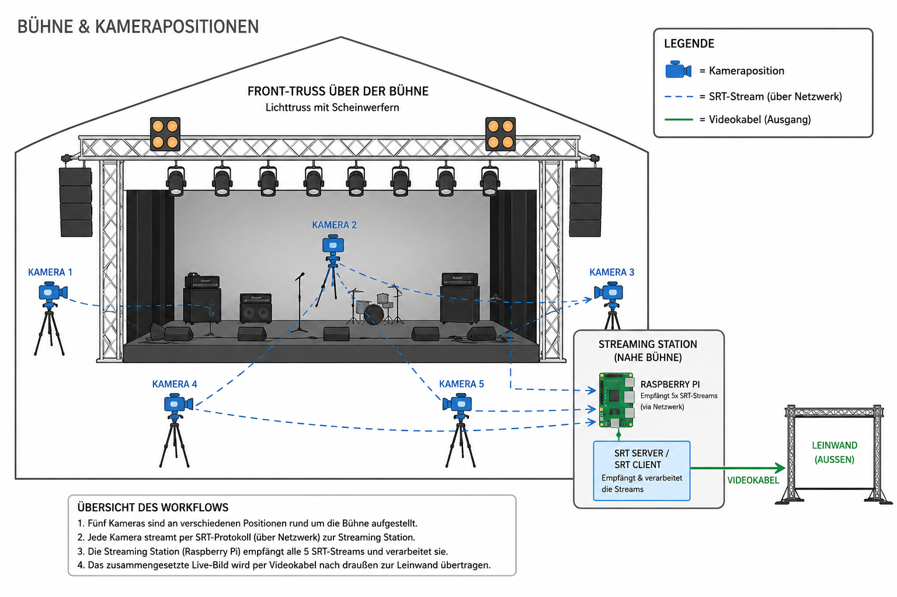
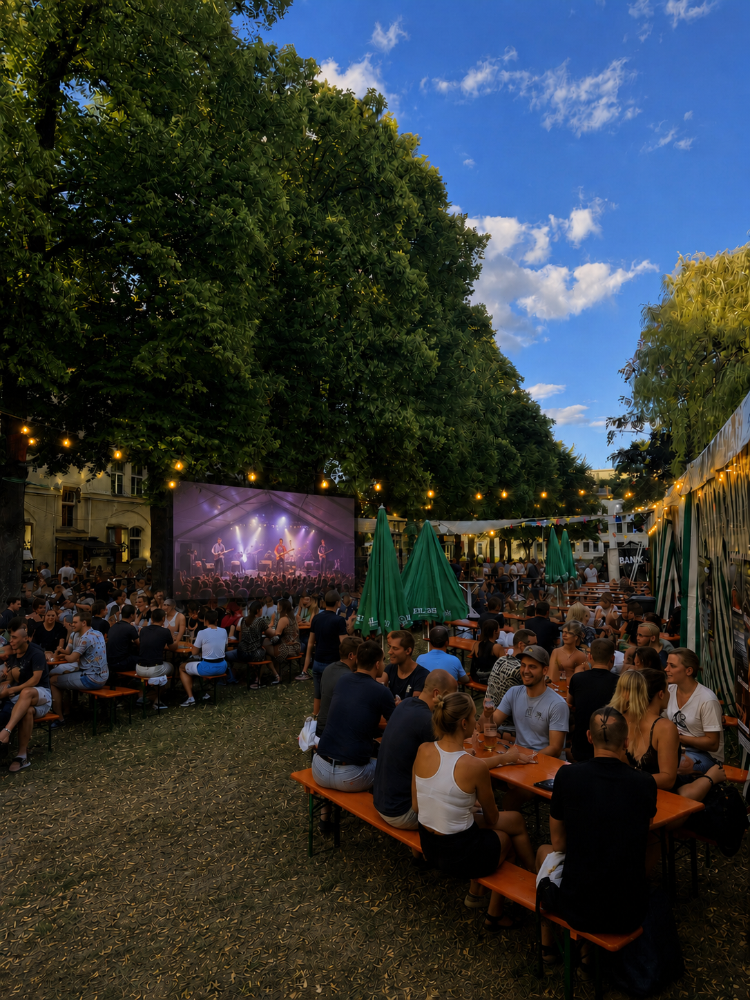

# licht

A GStreamer-based video switcher for SRT camera sources (e.g. an iPhone streaming app), controlled over a small FastAPI HTTP API. It builds a live pipeline with an `input-selector` so the active camera can be switched at runtime without restarting playback.

## Setup example

Five cameras positioned around a stage each stream over SRT to a Raspberry Pi running this project, which switches between them and outputs the composed live picture over a video cable to an outdoor screen:



The result, running at an outdoor event:



## How it works

- Each configured source is an SRT listener with a fixed decode chain — `srtsrc` (listener mode) → `tsdemux` → `h265parse` → `v4l2slh265dec` (hardware-accelerated stateless HEVC decode) — rather than `uridecodebin`, so it never falls back to a software H265 decoder.
- The decoded frame is normalized to a common format (1280x720@30fps by default, via `videoconvert` / `videoscale` / `videorate`) and fed into a shared `input-selector`. `videorate` is required because live sources (e.g. a phone camera) often report a variable framerate (`framerate=0/1`), which otherwise fails to negotiate against the fixed output caps.
- The selector's output is split with a `tee`: one branch goes through `videoconvert` into a video sink (`kmssink` by default, for direct KMS/DRM output on a headless console), the other feeds an `appsink`-based screenshot capture branch (see below). `sync` is forced off on the sink, since a live SRT source can drift enough against the pipeline clock that `kmssink`'s default `sync=true` never releases a frame.
- All queues are low-latency (`leaky=downstream`, small `max-size-buffers`) so a network hiccup or decoder stall gets shed instead of building up an ever-growing backlog.
- Connects/disconnects on each SRT listener source, per-source SRT stats (every 5s), pipeline latency recalculations, and any GStreamer pipeline errors/warnings are all logged.
- A source whose URL isn't `srt://` is treated as a local video file (e.g. an `.mp4`) and played back with `uridecodebin` → the same normalization chain → the shared `input-selector`, so it can be switched to/from just like a camera. Unlike the SRT branch, the codec isn't known ahead of time, so it's autoplugged rather than pinned to a specific decoder. Any non-video pad (e.g. audio) is drained into a `fakesink` so it doesn't stall the decoder. A dedicated `identity sync=true` element paces this branch to real time — the shared sink runs with `sync=false` (see below), so without it a file would decode and play back as fast as the CPU allows.
- This Pi model only has a hardware decoder for HEVC (`v4l2slh265dec`, the same one the SRT branch uses), not H.264 — an H.264 file falls back to (much heavier) software decoding. Encode file sources as H.265, ideally already at the target resolution/framerate (see `width`/`height`/`framerate` above), e.g. `ffmpeg -i in.mp4 -vf "scale=1280:720,fps=30" -c:v libx265 -an out.mp4`. Unlike the SRT branch's concern about `uridecodebin` autoplugging a software H.265 decoder, this turned out to be a non-issue in practice: `v4l2slh265dec` has a higher GStreamer element rank than `avdec_h265`, so `uridecodebin` picks it automatically (verified via `GST_DEBUG=GST_ELEMENT_FACTORY:5`).
- File sources only play while selected as the program source: they stay in `NULL` (`locked-state`, no open device, no buffers held) until `switch()` unlocks and sets them to `PLAYING`; switching away tears them back down to `NULL` and re-locks them. This isn't just a memory optimization — the Pi's HEVC decoder can only run a limited number of concurrent hardware sessions, and the two SRT cameras already occupy one each, so releasing a file source's decoder when it's not on air matters. Since each selection rebuilds the decode chain from scratch, playback always starts from `0`, no explicit seek needed. While selected, reaching end-of-stream loops the file rather than ending it: EOS is caught on the source's own output pad (a pad probe, not a bus watch) and dropped, and the `uridecodebin` is seeked back to `0` via `GLib.idle_add` (the seek can't run synchronously from inside the probe — that's the source's own streaming thread, which the seek's flush needs to proceed, so a direct call there would deadlock).
- A background GLib main loop drives the GStreamer pipeline while FastAPI serves API requests on the main thread.

Cameras and pipeline settings are defined in `server.py` via `VideoSettings`:

```python
VIDEO_SETTINGS = VideoSettings(
    sources={
        "iphone": "srt://0.0.0.0:6001?mode=listener&latency=120",
        "bumper": "videos/bumper.mp4",
    },
    sink="kmssink",
)
```

`VideoSettings` fields:

| Field                | Default              | Description                                                              |
| --------------------- | -------------------- | -------------------------------------------------------------------------- |
| `sources`             | `{}`                 | Map of source name to either an SRT URI (`srt://...?mode=listener&...`) or a local video file path/`file://` URI, which loops |
| `sink`                | `"kmssink"`           | Output sink (e.g. `kmssink`, `waylandsink`, `glimagesink`)                |
| `width` / `height`    | `1280` / `720`        | Normalized output resolution                                             |
| `framerate`           | `30`                 | Normalized output framerate                                              |
| `screenshot_path`     | `"screenshot.png"`   | Where periodic screenshots are written (overwritten in place)             |
| `screenshot_interval` | `None`               | Seconds between screenshot captures; `None` disables periodic capture     |

## Requirements

System packages (installed via `makefile`):

- `python3`, `python3-gi`, `python3-gst-1.0`
- GStreamer 1.0 core, tools, and plugin sets (`base`, `good`, `bad`, `ugly`, `libav`)
- A `v4l2slh265dec` element (stateless V4L2 HEVC decode) — on a Raspberry Pi this needs a kernel/driver with V4L2 request-API HEVC support; the pipeline will fail to build without it

Python packages (install separately, not yet pinned in a manifest):

- `fastapi`
- `pydantic`
- `uvicorn`
- `PyGObject` (provides the `gi` module, usually installed via `python3-gi`)

## Setup

Install system dependencies and verify the GStreamer install:

```bash
make -f makefile
```

This installs the required apt packages, prints the `gst-launch-1.0` version, and checks that the `Gst` GObject Introspection bindings import correctly.

Then install the Python dependencies:

```bash
pip install fastapi pydantic uvicorn
```

## Running

```bash
python3 server.py
```

The API listens on `0.0.0.0:8000`.

> The default sink is `kmssink` for direct KMS/DRM output on a headless Raspberry Pi console. On a Wayland session, set `VideoSettings(sink=...)` to a sink appropriate for the display instead (e.g. `waylandsink` or `glimagesink`).
>
> There's a known issue where `v4l2slh265dec` → `kmssink` with DMA-BUF can produce a corrupted image on some systems; routing through an extra `videoconvert` before `kmssink` avoids it (see `TODO.md`).

## API

### `GET /sources`

List the configured camera source names.

```bash
curl http://localhost:8000/sources
```

```json
{"sources": ["cam1", "cam2", "cam3"]}
```

### `PUT /program`

Switch the active (program) video source.

```bash
curl -X PUT http://localhost:8000/program \
  -H "Content-Type: application/json" \
  -d '{"source": "cam2"}'
```

```json
{"status": "ok", "active_source": "cam2"}
```

Returns `404` if the requested source name isn't configured.

## Screenshots

Periodic screenshots are off by default (`screenshot_interval=None`). When set to a number of seconds, the currently active program output is captured on that interval and written as a PNG to `screenshot_path` (the file is overwritten in place). If no source is currently streaming into the active pad, the capture is skipped and logged (`Screenshot übersprungen: kein Frame verfügbar (Quelle aktiv?)`).

There is no HTTP endpoint to fetch the screenshot yet.
